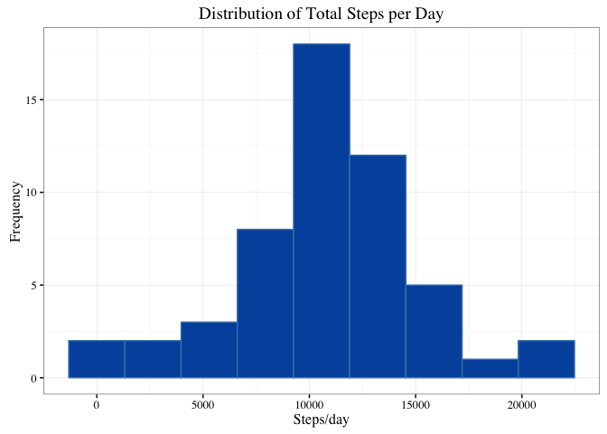
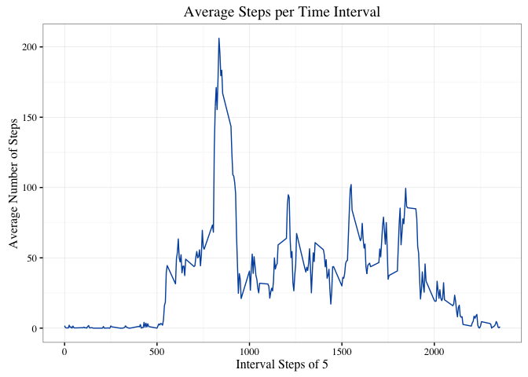
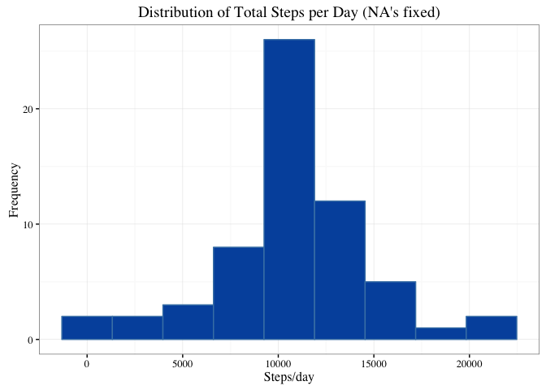
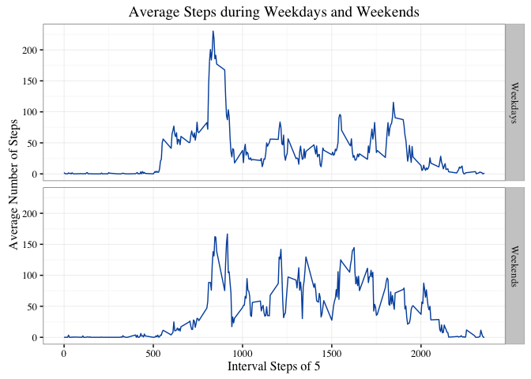

Introduction
------------

This project makes use of [Activity Monitoring
Data](https://d396qusza40orc.cloudfront.net/repdata%2Fdata%2Factivity.zip)
dataset which was collected using a personal activity monitoring device.
The data includes number of steps taken at every 5 minute interval over
a two month period (October - November, 2012). The objective of the
project is to explore the the walking behavior of the person from whom
the dataset was obtained.

Loading and preprocessing the data
----------------------------------

The current directory during excecution of program is expected to be in
**RepData\_PeerAssessment1**, which is the [repository
forked](https://github.com/rdpeng/RepData_PeerAssessment1) for the
project.

    # Loading the data
    if(!file.exists("activity.csv")) {
            unzip("activity.zip")
    }

    if (!exists("AMD")) {
            AMD <- read.csv("activity.csv")
    }

    #  Loading required libraries
    library(ggplot2)
    library(dplyr)

What is mean total number of steps taken per day?
-------------------------------------------------

**Step 1:** Calculate the total steps taken per day.

    ## total steps per day
    totalSteps <- aggregate(steps ~ date, data = AMD, FUN = sum)

**Step 2:** Plot the histogram distribution of total number of steps per
day.

    ## Using ggplot to plot a histogram distribution
    ggplot(data = totalSteps, mapping = aes(steps)) +
            geom_histogram(bins = 9, col = "steelblue", fill = rgb(0.00,0.33,0.67)) + 
            labs(title = "Distribution of Total Steps per Day", x = "Steps/day", y = "Frequency") +
            theme_bw(base_family = "Times")

**Step 3:** Calculate the mean and median steps per day

    as.integer(mean(totalSteps$steps))

    ## [1] 10766

    as.integer(median(totalSteps$steps))

    ## [1] 10765

What is the average daily activity pattern?
-------------------------------------------

**Step 1:** Calculate average number of steps for each time interval

    ## average no. of steps for given time interval
    averageSteps <- aggregate(steps~interval,data = AMD, FUN = mean)

**Step 2:** Show the result in line plot

    ## lineplot of a average no. of steps as a function of Interval steps
    ggplot(data = averageSteps, mapping = aes(x = interval, y = steps)) +
            geom_line(lty = 1, col = rgb(0.00,0.33,0.67)) + 
            labs(title = "Average Steps per Time Interval", x = "Interval Steps of 5", y = "Average Number of Steps") +
            theme_bw(base_family = "Times")

**Step 3:** Identify 5-minute interval with the largest average steps

    ## Step 3
    averageSteps$interval[which.max(averageSteps$steps)]

    ## [1] 835

Imputing missing values
-----------------------

**Step 1:** Calculate the total number of missing values

    ## Total no. of missing values
    sum(is.na(AMD$steps))

    ## [1] 2304

    ## Missing values: Percent of Total
    mean(is.na(AMD$steps))

    ## [1] 0.1311475

**Step 2:** To impute the missing data, **mean steps for the given 5
minute interval** is used. Moreover, the average steps for the interval
is already available.

***Step 3:*** With the imputing strategy, update the original data.

    ## split clean and na data
    cleanData <- AMD[!is.na(AMD$steps),]
    naData <- AMD[is.na(AMD$steps),]

    ## update NA data
    naUpdated <- merge(naData, averageSteps, by = "interval")
    naUpdated <- select(naUpdated,steps.y,date,interval)
    naUpdated <- rename(naUpdated, steps = steps.y)

    ## Bind clean and uodated data to get data frame with na removed
    naRemovedData <- rbind(naUpdated, cleanData)
    naRemovedData <- naRemovedData[order(naRemovedData$date,naRemovedData$interval),]

    ## Converting no. of steps to integer value
    naRemovedData$steps <- as.integer(naRemovedData$steps)

**Step 4:** Plot the histogram distribution of total number of steps per
day after imputing the missing data

    ## total steps per day
    totalSteps <- aggregate(steps ~ date, data = naRemovedData, FUN = sum)

    ## histogram plot
    ggplot(data = totalSteps, mapping = aes(steps)) +
            geom_histogram(bins = 9, col = "steelblue", fill = rgb(0.00,0.33,0.67)) + 
            labs(title = "Distribution of Total Steps per Day (NA's fixed)", x = "Steps/day", y = "Frequency") +
            theme_bw(base_family = "Times")

**Step 5:** Calculate the mean and median steps per day. Report the
differences in result when the missing data was not imputed.

    as.integer(mean(totalSteps$steps))

    ## [1] 10749

    as.integer(median(totalSteps$steps))

    ## [1] 10641

-   The mean total steps per day reduces only slightly after imputting
    the missing data. This is expected given that missing data from the
    original set was always for an entire day. This implies we were
    basically inputing average steps/day to the missing days.

-   The median drops by a fair amount compared to the mean. This is
    because the data that was missing previously is now tentatively mean
    steps per day, thus shifting the median to the left.

Are there differences in activity patterns between weekdays and weekends?
-------------------------------------------------------------------------

**Step 1:** Categorize the data by Weekdays and Weekends factor

    naRemovedData$days <- weekdays(as.Date(naRemovedData$date))
    naRemovedData$dayCategory <- ifelse(naRemovedData$days %in% c("Saturday", "Sunday"), "Weekends", "Weekdays")
    naRemovedData$dayCategory <- as.factor(naRemovedData$dayCategory)

**Step 2:** Average number of steps for each 5-minute interval
categorized into Weekdays and Weekends

    ## Calculating average no. of steps
    meanStepsDays <- aggregate(steps ~ interval + dayCategory,data = naRemovedData, FUN = mean)

    ## lineplot of a average no. of steps as a function of Interval steps
    ggplot(data = meanStepsDays, mapping = aes(x = interval, y = steps)) +
            geom_line(lty = 1, col = rgb(0.00,0.33,0.67)) +
            facet_grid(dayCategory ~ .) +
            labs(title = "Average Steps during Weekdays and Weekends", x = "Interval Steps of 5", y = "Average Number of Steps") +
            theme_bw(base_family = "Times")

Indeed, the average steps tends are different in weekends and weekdays.
Steps are evenly spread throughout the day in Weekends, compared to only
the morning steps spikes on Weekdays.
